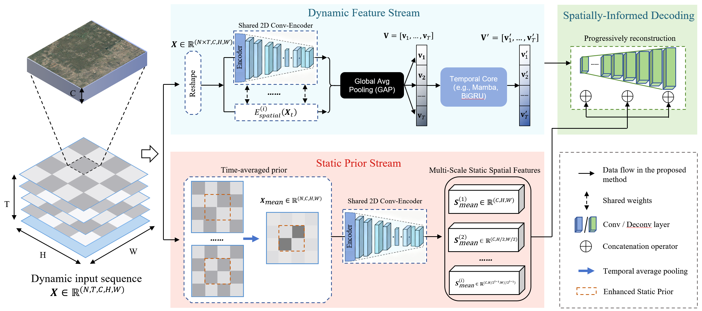

# ST-Mamba

**Short Description:** Official PyTorch implementation for the paper (under submission): *Decoupling Static Context and Dynamic Change: A Spatio-Temporal Decoder with Time-Averaged Priors for Multi-Decadal Monitoring*. This project provides a novel spatio-temporal segmentation architecture that decouples long-term dynamic priors (from all timesteps) from high-resolution static context (from the last timestep) for fine-grained time-series monitoring.

## 📜 Overview

This project aims to perform fine-grained monitoring and segmentation of specific sites using multi-decadal long-term time-series (LTS) remote sensing imagery. The core challenge in processing such LTS data is how to effectively distinguish between the stable spatial background (**Static Context**) and the subtle changes that occur over time (**Dynamic Change**).

We propose a new spatio-temporal segmentation architecture centered on the idea of **decoupling**. Our model (`SpatioTemporalFusion`) uses a special decoder that reconstructs the segmentation map from two independent information streams:

1.  **Time-Averaged Priors**: A deep feature vector fused from the bottleneck features of the *entire* time series (e.g., 1990-2025). This vector represents a global summary of "dynamic change" and is injected at the decoder's bottleneck.
2.  **Static Context**: High-resolution spatial feature maps extracted *only from the latest timestep* (e.g., 2025). These features are provided to the decoder via skip-connections, ensuring the spatial precision and detail of the final segmentation.

## 🏛️ Methodology

Our core contribution lies in the design of the Decoder. As shown in the figure below, the decoder receives information from two decoupled sources:

1.  A shared-weight 2D U-Net encoder processes each timestep ($T_1, ..., T_N$) independently.
2.  The bottleneck features from all timesteps are collected and fed into a temporal fusion module (like GRU or Mamba) to generate a single, fused vector $\mathbf{v}_{\text{fused}}$ representing "dynamic change."
3.  This $\mathbf{v}_{\text{fused}}$ vector is reshaped to serve as the *initial feature map* for the decoder.
4.  The decoder then upsamples using skip connections from *only the last timestep* ($T_N$), thus combining the high-frequency "static context" with the fused "dynamic prior."



## 📦 Repository Structure
├── README.md                   # This file: project overview, installation, usage, and more
├── models/                     # Model architectures for spatio-temporal segmentation
│   ├── __init__.py             # Package initializer for importing models
│   ├── unet.py                 # Standard U-Net model
│   ├── unet3d.py               # 3D U-Net with (2+1)D convolutions
│   ├── convgru_unet.py         # U-Net with ConvGRU for temporal modeling
│   ├── convlstm_unet.py        # U-Net with ConvLSTM for temporal modeling (ViT integration placeholder)
│   ├── st_bigru.py             # Spatio-Temporal BiGRU model (ST-BiGRU)
│   └── st_mamba.py             # Spatio-Temporal Mamba model (ST-Mamba)
├── data_process/               # Scripts for dataset balancing and preprocessing
│   ├── __init__.py             # Package initializer for data processing utilities
│   ├── config.py               # Configuration settings for directories and hyperparameters
│   ├── split_loader.py         # Loads original dataset splits
│   ├── patch_classifier.py     # Classifies patches as positive/negative using multiprocessing
│   ├── balancer.py             # Balances samples based on negative-to-positive ratio
│   ├── split_saver.py          # Saves balanced splits to new files
│   └── main.py                 # Main script to run the balancing process for all splits
└── preprocessed_dataset/       # Placeholder for dataset (not included; user-provided)
    ├── splits/                 # Original train/val/test splits
    ├── labels/                 # Label patches (.npy files)
    └── splits_balanced/        # Output directory for balanced splits

### Core Script Descriptions

* **`config.py`**: rovides a function to retrieve configuration parameters, such as directory paths, balancing ratio, and number of workers.

* **`train_parally.py`**: The main training file. It uses PyTorch DDP (`DistributedDataParallel`) for efficient multi-GPU training. It handles data loading, model initialization, and the training/validation loops.

* **`split_loader.py`**: Loads basenames from original split files (e.g., train.txt) for processing.

* **`patch_classifier.py`**: Classifies label patches into positive (containing heritage elements) and negative (background-only) using parallel processing with concurrent futures.
  
* **`balancer.py`**: Downsamples negative patches to achieve the desired negative-to-positive ratio and shuffles the combined list.
  
* **`split_saver.py`**: Writes the balanced list of basenames to new split files.
  
* **`main.py`**: Orchestrates the balancing pipeline for train/val/test sets, calling the above utilities in sequence.


## 🚀 How to Use

### 1. Environment Setup

Please ensure you have all necessary dependencies installed. The `train_parally.py` script uses DDP for distributed training. Additionally, if you wish to use Mamba, you must install `mamba_ssm`.

```bash
# Recommended to use a new conda or venv environment
pip install torch torchvision numpy tqdm
pip install mamba_ssm  # If you want to use --temporal-module mamba
```

# TODO: The full ReadMe will be released soon!!!

Before training, run balance_sample.py to create balanced train/val/test split files.
